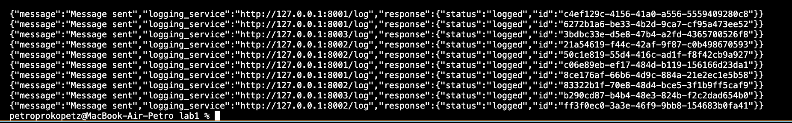
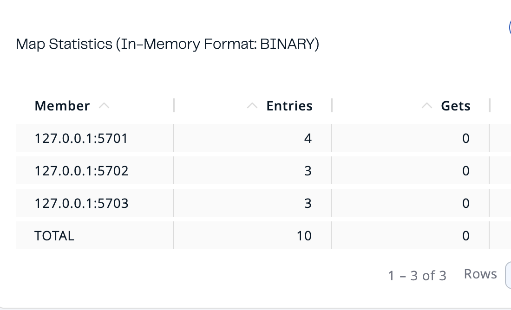
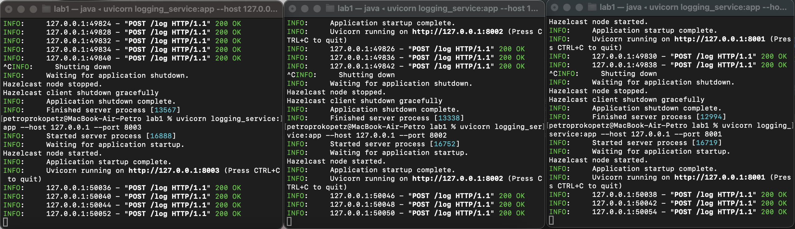
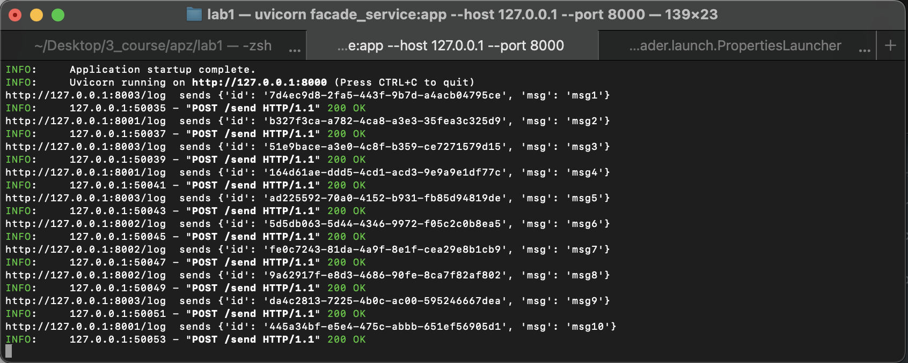
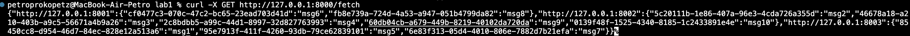
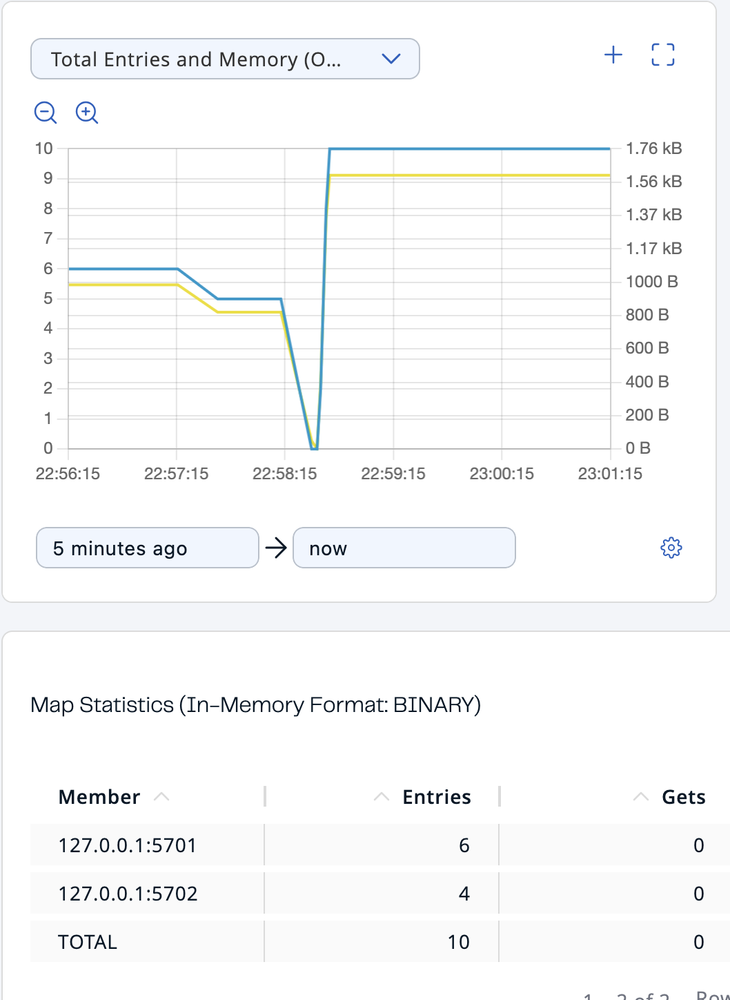
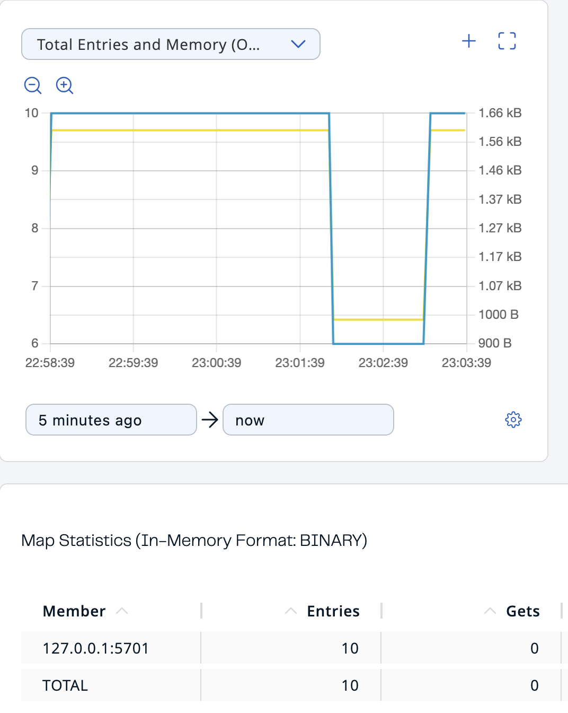

# LAB 3
## Запустити три екземпляра logging-service (локально їх можна запустити на різних портах), відповідно мають запуститись також три екземпляра Hazelcast
Запускаємо три екземпляра за допомогою наступних команд:
```
uvicorn logging_service:app --host 127.0.0.1 --port 8001  
uvicorn logging_service:app --host 127.0.0.1 --port 8002
uvicorn logging_service:app --host 127.0.0.1 --port 8003
```
Node's сворюються атоматично при запуску багатьох екземплярів logging_service.

## Через HTTP POST записати 10 повідомлень msg1-msg10 через facade-service
Стоврив мапу за допомогою ` log_map = hz_client.get_map("logs").blocking()` й наповнив повідомленнями:

Як бачимо, дані записались:


## Показати які повідомлення отримав кожен з екземплярів logging-service (це має бути видно у логах сервісу)
Після запису отримали наступний розподіл:

Й наступні логи:

## Через HTTP GET з facade-service прочитати повідомлення
За запитом 
```
curl -X GET http://127.0.0.1:8000/fetch
```
ми отримаємо наступний результат:

## Вимкнути один/два екземпляри logging-service (разом з ним мають вимикатись й ноди Hazelcast) та перевірити чи зможемо прочитати повідомлення 
### Вимикаємо один:
Відбувся перерозмоділ й повідомлення ми не втратили:

### Вимикаємо два:
